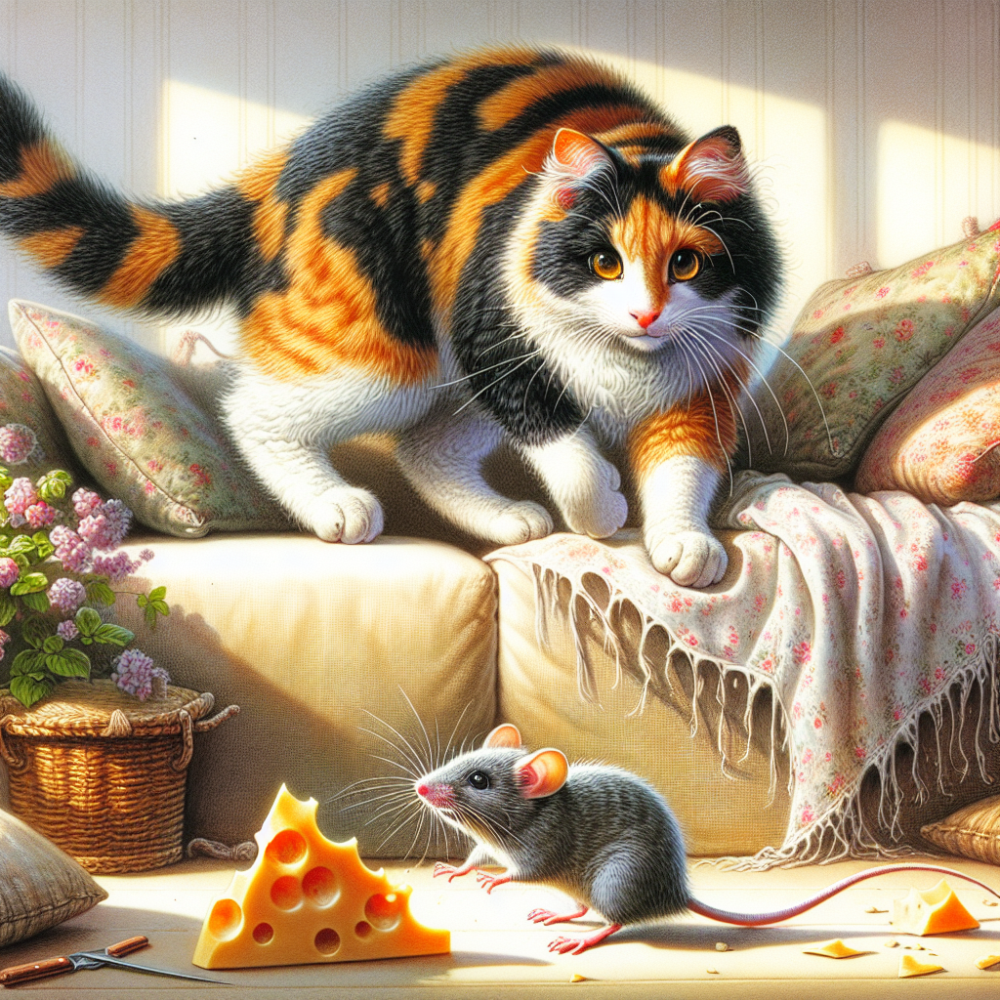
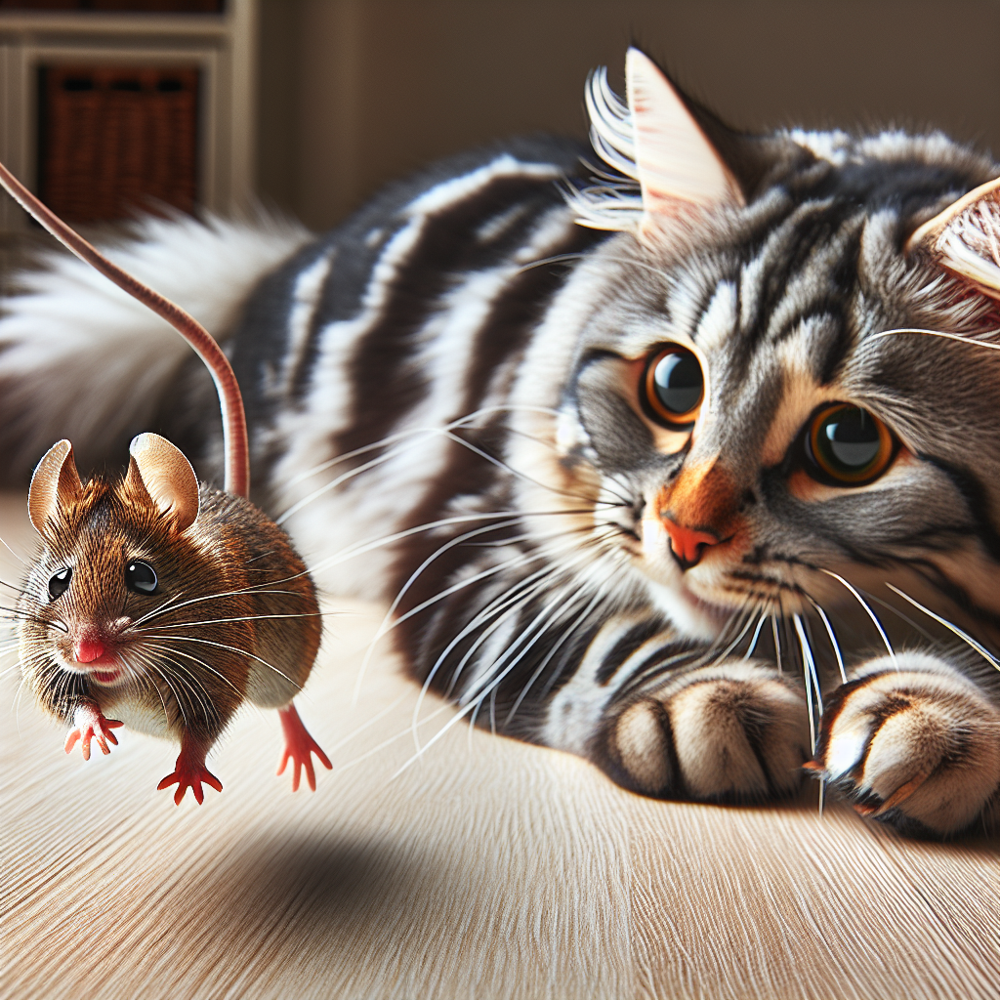
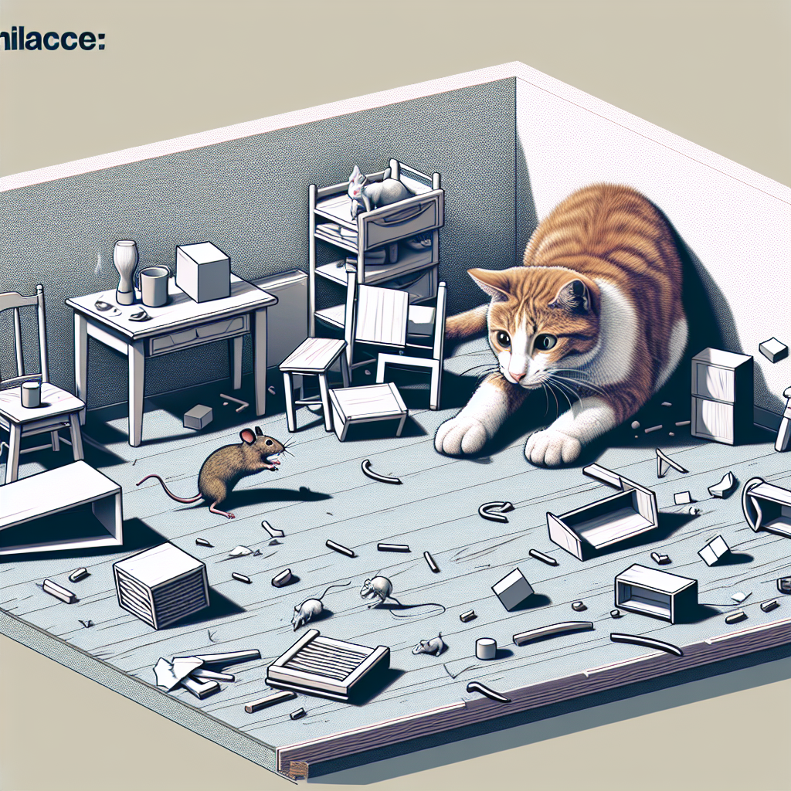
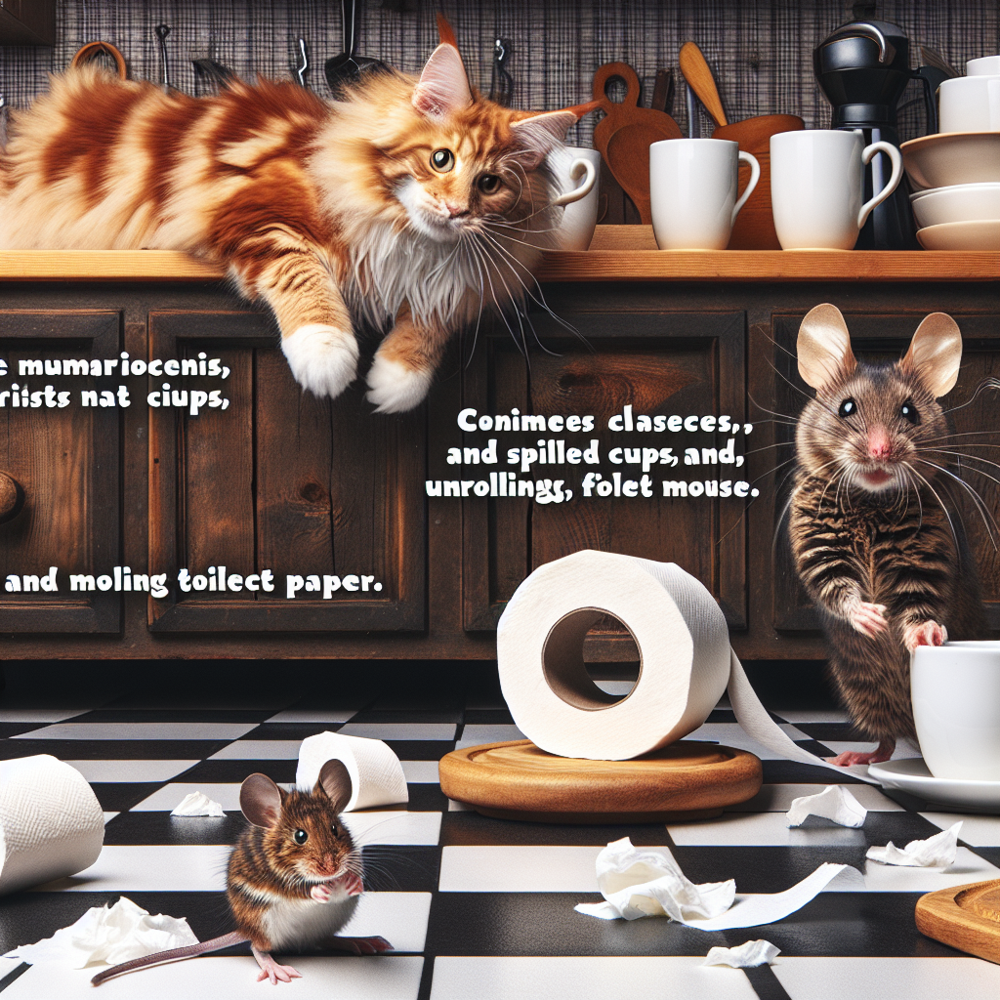
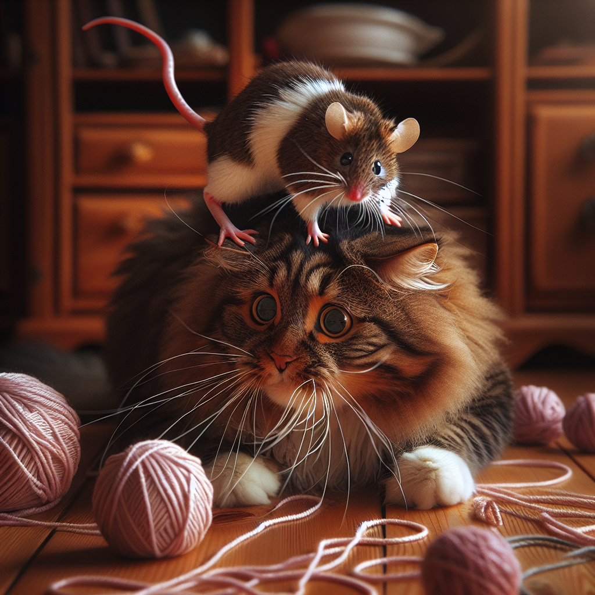
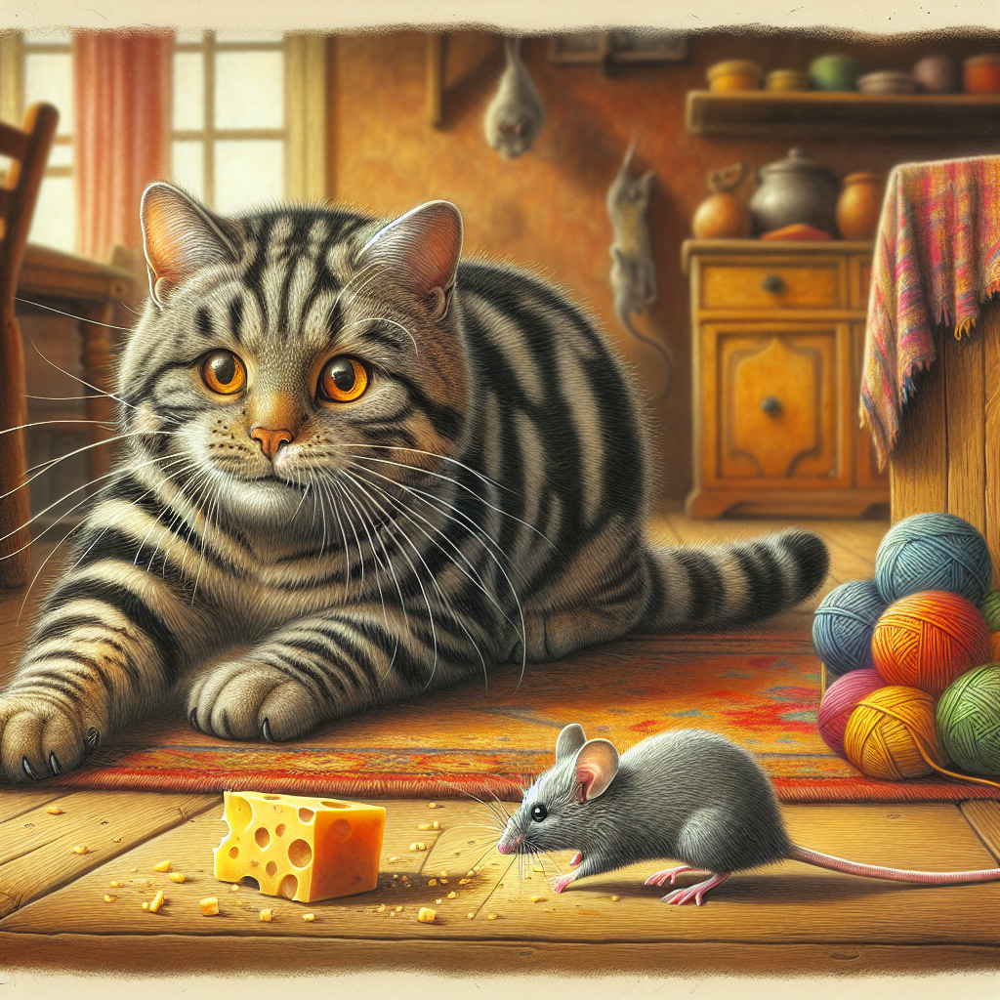
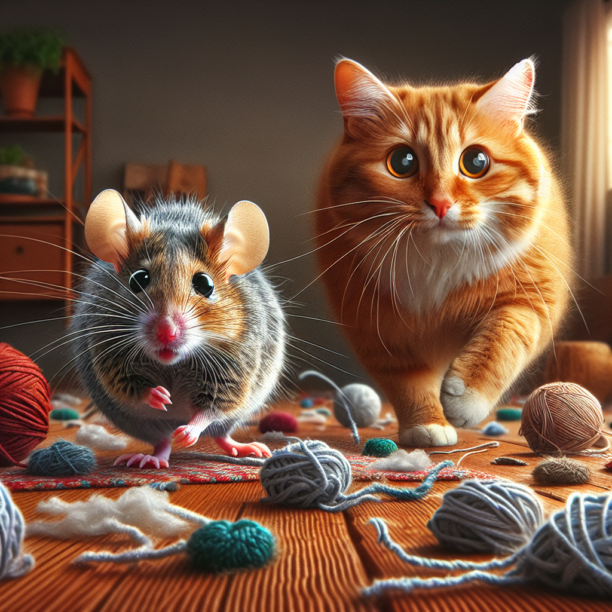
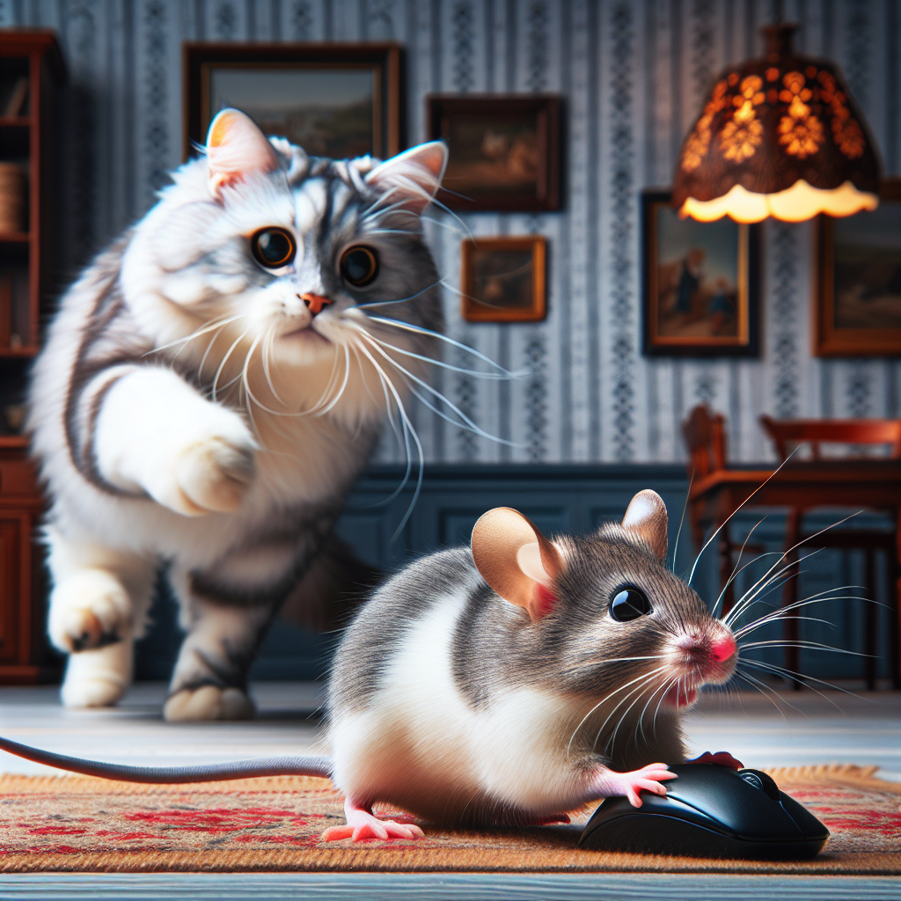
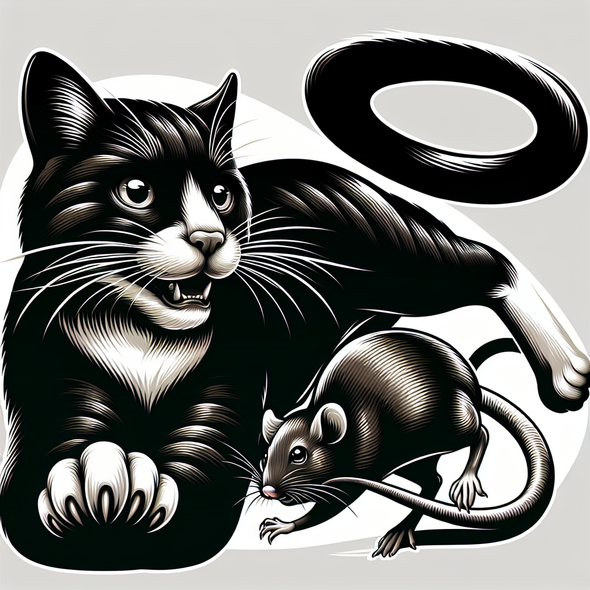
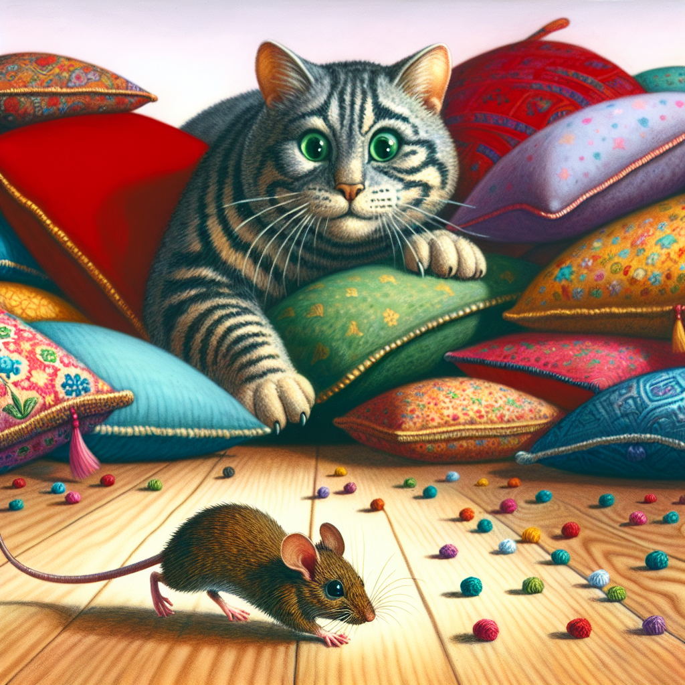

# "The Chaotic Adventures of Cat and Mouse"

Cat was a quiet and tame housecat, all until Mouse showed up unannounced.

Cat immediately began to chase Mouse around the house.

Looking at the mess Cat and Mouse made in their chase, they decide to team up to clean it up.

Even the bathroom was a mess, with toilet paper everywhere.

After doing some cleaning, Cat and Mouse play with toys together, creating even more mess in the process.

Mouse begins to get comfortable, finally approaching Cat herself and perching on her head.

Mouse indulges in a quick snack of cheese, while Cat watches with jealousy as she's allergic to cheese.

Through time spent together, Mouse begins to act like Cat, even growing in size to better match her.

Mouse begins to mess with Cat's human's belongings, which is where Cat draws the line.

Mouse turns out to excel greatly with technology, to Cat's surprise, and electronically draws a portrait of them together.

Cat admires Mouse as her new best friend, watching her play from afar.

Cat is content with her new friendship, although they do need to stop making such messes!
